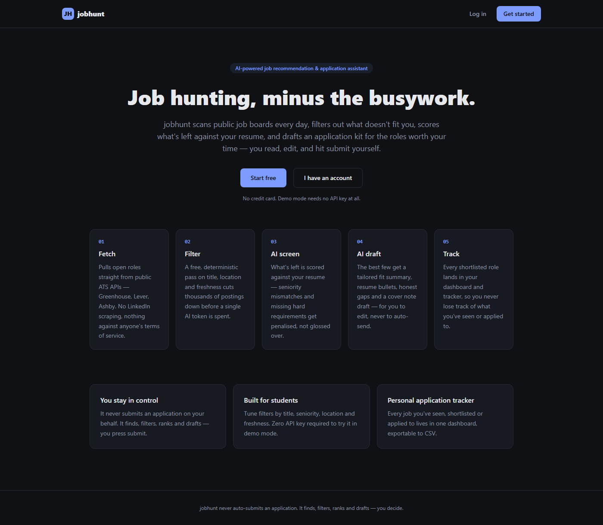
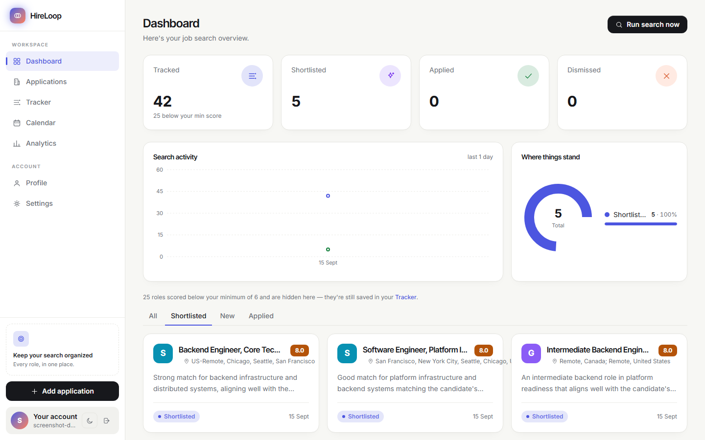
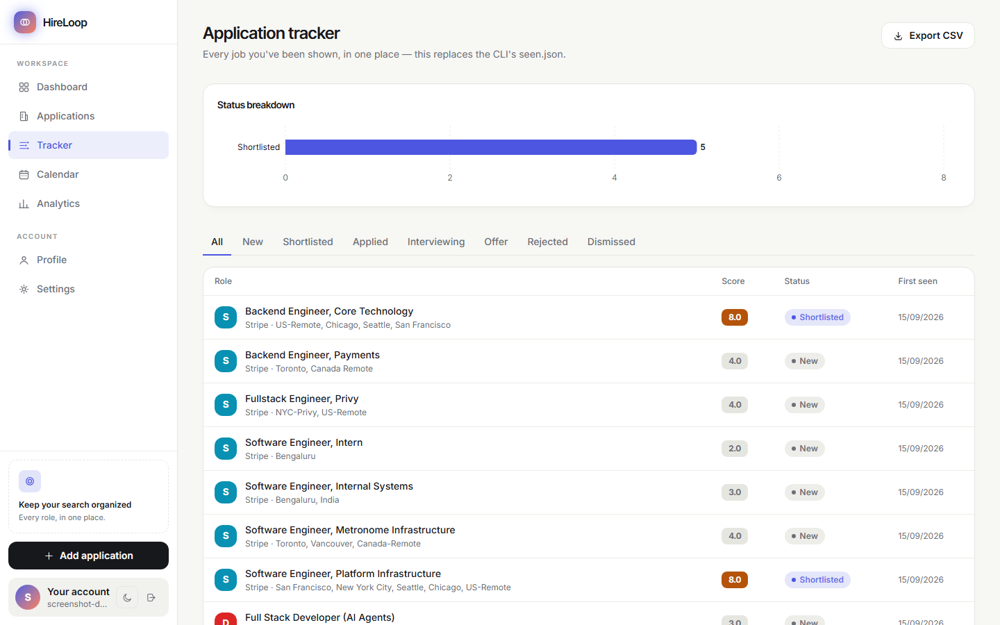

# HireLoop — AI job recommendation & application assistant

A full-stack web app that reads public job boards every day, throws away
the ~99% of postings that don't fit a candidate, scores what's left
against their resume with an LLM, drafts an application kit for the best
few, and tracks the whole application history in a personal dashboard.

**It never submits an application.** It finds, filters, ranks and drafts.
The candidate reads the shortlist, edits the cover note, and presses
submit themselves.

```
1,506 postings  →  4 candidates  →  2 worth your time
    fetch           regex/location/    AI screen
                     freshness gate      + draft
                     (free, no AI)
```
*(a real run against the 15 companies in this repo's example
`companies.yaml`)*

<p align="center">
  
  
  
</p>

---

## What it is

| | |
|---|---|
| **Multi-user** | Every user gets their own account, resume, filters, and tracker |
| **AI-powered** | A two-stage LLM pipeline — cheap screening over everything, an expensive draft only for the shortlist — swappable across 5 providers (Claude, Gemini, Groq, any OpenAI-compatible endpoint, or fully local Ollama) |
| **Zero-key demo mode** | A keyword-overlap stub scores jobs with no API key at all, so the whole product is explorable without spending anything |
| **Real data sources** | Public, documented ATS APIs — Greenhouse, Lever, Ashby. No LinkedIn/Naukri scraping (no public API, against ToS) |
| **Application tracker** | Every job seen, shortlisted, applied to, or dismissed lives in one dashboard, exportable to CSV |
| **Human-in-the-loop** | Cover notes and resume bullets are drafts you edit — the system has no code path to actually submitting anything |

This started as a personal CLI tool (still included and fully working —
see [docs/CLI.md](docs/CLI.md)) and was rebuilt as a full-stack product on
top of the same, unmodified pipeline package. See
[docs/ARCHITECTURE.md](docs/ARCHITECTURE.md) for how the two fit together
and why the job-fetching layer is shared across users while the ranking
stays personal.

## Quickstart

No Docker, no extra installs beyond Python and Node, which you need either
way:

```bash
# terminal 1 - backend
cd backend
python -m venv .venv && .venv/Scripts/activate   # or source .venv/bin/activate
pip install -r requirements.txt
cp .env.example .env
python seed_companies.py
uvicorn app.main:app --reload

# terminal 2 - frontend
cd frontend
npm install
npm run dev
```

Open **http://localhost:5173**. Register, skip the resume upload (or
upload one if you've set an LLM key in `backend/.env`), tick "Demo mode"
on the dashboard, and click **Run search now** — no API key required for
that path.

Have Docker and want one command instead? `docker compose up --build` at
the repo root does the same thing — see
[docs/DEPLOYMENT.md](docs/DEPLOYMENT.md#local-two-terminals-no-docker),
which also covers deploying live to Render + Neon + Vercel (all free
tier, and none of them need Docker installed on your machine either —
Render builds the container on its own servers).

## Tech stack

**Backend** — FastAPI, SQLAlchemy (SQLite locally / Postgres in
production), JWT auth, pytest.
**Frontend** — React 19, TypeScript, Vite, Tailwind CSS v4, TanStack
Query, React Router, react-hook-form + zod, Recharts.
**AI/pipeline** — the original `jobhunt/` package: a provider-agnostic
LLM layer (Anthropic / Gemini / Groq / OpenAI-compatible / Ollama), pure
ATS parsers, deterministic prefiltering.

## Project layout

```
jobhunt/       the original pipeline package - fetch, prefilter, LLM
               screen/draft, digest, mailer. Unmodified by the web
               rebuild; still runs standalone (docs/CLI.md).
backend/       FastAPI app wrapping jobhunt/ - auth, per-user profiles/
               filters/companies, a shared job cache, the tracker.
frontend/      React dashboard - onboarding, shortlist, job detail,
               tracker, settings.
docs/          ARCHITECTURE.md, DEPLOYMENT.md, CLI.md, screenshots/.
tests/         63 tests for jobhunt/ - no network, no API key.
backend/tests/ 28 tests for the API - same no-network philosophy.
```

## Tests

```bash
python -m pytest tests -q                 # pipeline package - 63 tests
cd backend && python -m pytest tests -q   # API - 28 tests
cd frontend && npm run build              # type-checks + builds
```

None of the three need a network connection or an API key.

## Cost

Fetching and prefiltering are free. Screening runs on whatever's
configured server-side — point it at Gemini or Groq's free tier and the
whole thing costs nothing; add a paid model for the (much smaller,
capped) drafting stage and daily cost lands in the low single digits of
rupees for a modest company list. `docs/CLI.md#cost` has the fuller
breakdown from the original single-user tool.
